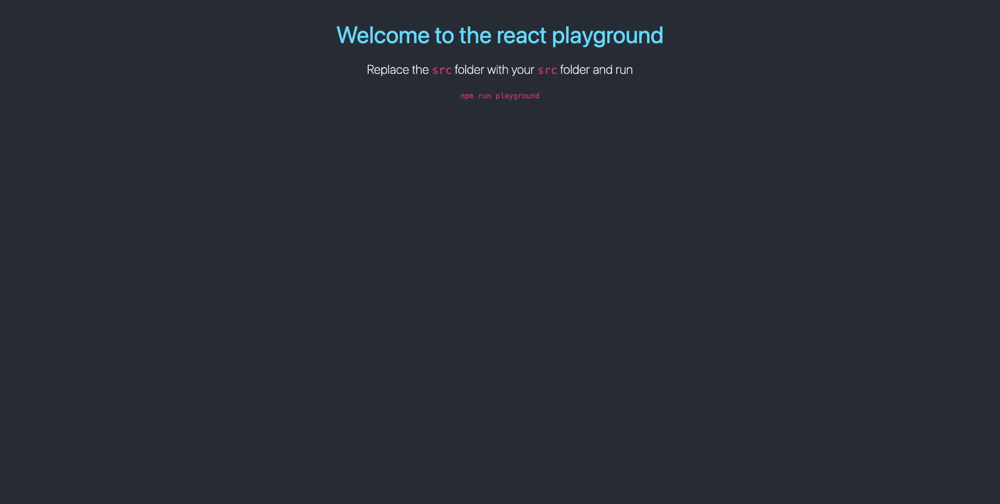

# React Training

## Pre-requisites

#### 1. Create A Project Workspace

This workspace is a folder which will contain multiple **projects/repositories**.

You will always navigate to this folder in your **terminal** when you start class.

If you want to create a **new project** you will do that in this workspace.

**DO NOT** create projects outside this folder as it is good to keep all your projects organised within a dedicated workspace.

```
cd
mkdir coding_bootcamp
cd coding_bootcamp
```

- `cd` will change the directory to your home directory (Windows/MAC home directory)
- `mkdir coding_bootcamp` will make a directory (folder) called _coding_bootcamp_ in your home directory since you are currently in your home directory because of the previous command
- `cd coding_bootcamp` will change the directory to the newly created directory _coding_bootcamp_ since you created the directory in the previous command

---

#### 2. Setup your SSH Keys

If you do not have your SSH keys setup for GitHub please follow the [GITHUB_SSH_SETUP.md](./docs/GITHUB_SSH_SETUP.md) guide in the `docs` folder

---

#### 3. NodeJS Installation

Run the command `node --version` in your terminal and if a valid node version is displayed you can skip this step.

If you do not have NodeJS setup on yur machine please follow the [NODEJS_INSTALLATION_GUIDE.md](./docs/NODEJS_INSTALLATION_GUIDE.md) guide in the `docs` folder

## Getting Started

Navigate in to your coding bootcamp workspace to clone this repository

```
cd ~/coding_bootcamp
git clone git@github.com:surajverma2587/react-training.git
cd react-training
```

---

Install the dependencies for the react playground and run the playground. Please note that `npm run init` is a custom script that installs all the dependencies required by React in the `playground` directory.

```
npm run init
npm run playground
```

You should see a webpage open in your default browser on http://localhost:3000/ like this



## Running the playground

- Replace the `/src` directory in the `/playground` folder with the `/src` directory from either the challenges or the concepts (depending on what you want to run in the playground)
- Open your terminal and make sure you are in the root directory of the react-training project (entry directory of this repository)
- Run the following command in the terminal `npm run playground` and you should see your React application open in http://localhost:3000/
- If you want to stop the playground, in the terminal press (CTRL + C)

## Course Structure

### Week 1

---

#### Day 1

- Introduction to React
- Adding React to an existing website
- create-react-app script
- What is JSX?
- What is a component?
- What are props?

---

#### Day 2

- How to render many components?
- Class-based components
- What is state?
- React component lifecycle
- Conditional rendering

---

#### Day 3

- portfolio challenge

---

#### Day 4

- useState hook
- useState async behaviour
- Event handling (form submission)
- word count challenge

---

### Week 2

---

#### Day 1

- TODO

---

#### Day 2

- TODO

---

#### Day 3

- TODO

---

#### Day 4

- TODO

---

### Week 3

---

#### Day 1

- TODO

---

#### Day 2

- TODO

---

#### Day 3

- TODO

---

#### Day 4

- TODO

## Resources

TO ADD
