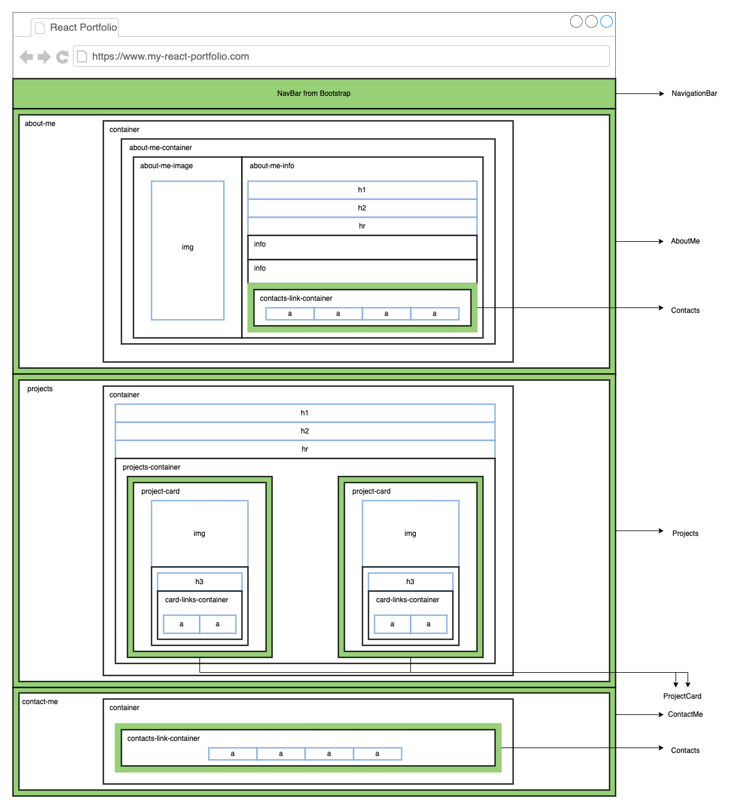
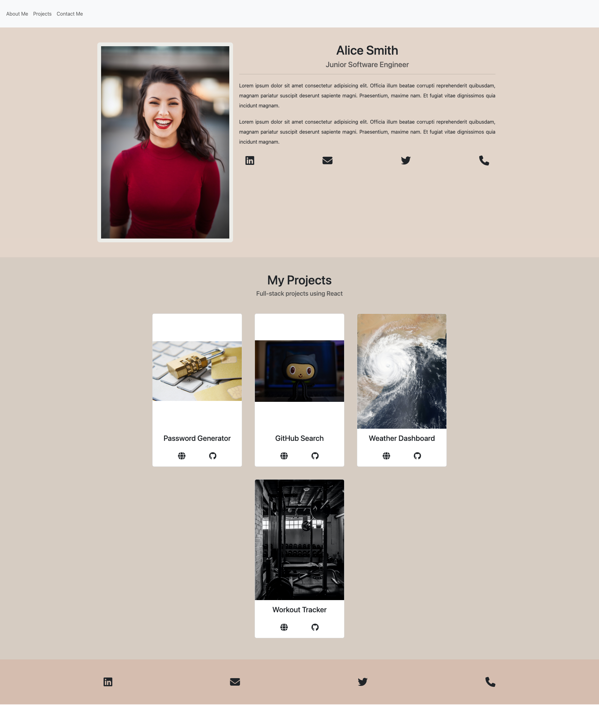

# React Portfolio

## User Story

I want to present my professional react portfolio to potential employers in the field of technology.

## Acceptance Criteria

- As a potential employer I should be able to view your full name, job title you are looking for and a short biography in a section about yourself
- As a potential employer I should be able to view a list of your projects in a projects section where each project must contain an image, a title, link to the source code, and link to the application
- As a potential employer I should be able to view your contact information in a contact section which contains the following links: LinkedIn profile, GitHub profile, email and telephone number
- As a potential employer I should be able to navigate through the different sections of the application; About Me (about-me), Projects (projects), and Contact Me (contact-me)

## Technical Criteria

- Ensure that the code follows semantic HTML structure
- Ensure that the code is well structured in to re-useable components
- Ensure the codebase follows the React files and folder structure
- Deploy the react application using [GitHub pages](https://github.com/gitname/react-gh-pages)

## Additional Resources

- You can use [Bootstrap 5](https://getbootstrap.com/docs/5.3/getting-started/introduction/) as your CSS framework
- You can choose a colour palette from [coolors](https://coolors.co/)
- You can import [font-awesome icons](https://fontawesome.com/icons) using the [CDN](https://cdnjs.com/libraries/font-awesome)

## Wireframe Guide

Please use this wireframe as a guide for your portfolio and you are free to choose your own colours and/or layout if needed.

## Example Portfolio

