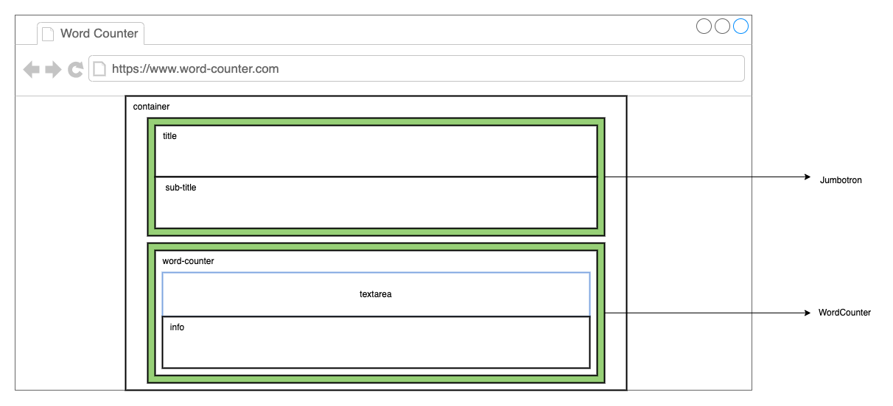
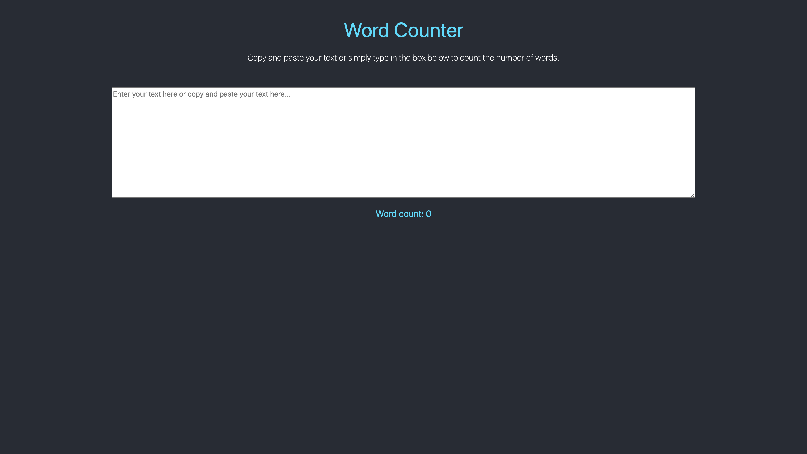

# Word Counter

## User Story

As a user I want to be able to count the number of words in a given snippet of text.

## Acceptance Criteria

- User should be able to type text and dynamically view the word count of the text content
- User should be able to copy and paste text which should dynamically display the word count of the text content
- The tool should contain a banner container the title of the application "Word Counter" and a subtitle "Copy and paste your text or simply type in the box below to count the number of words."
- The result should be displayed as follows `Word count: 100`
- The result should be displayed as follows when the page initially loads: `Word count: 0`

## Technical Criteria

- Use function based components
- Use the react hook `useState`
- Ensure that the code follows semantic HTML structure
- Ensure that the code is well structured in to re-useable components
- Ensure the codebase follows the React files and folder structure
- Deploy the react application using [GitHub pages](https://github.com/gitname/react-gh-pages)

## Additional Resources

- You can use [Bootstrap 5](https://getbootstrap.com/docs/5.3/getting-started/introduction/) as your CSS framework
- You can choose a colour palette from [coolors](https://coolors.co/)
- You can import [font-awesome icons](https://fontawesome.com/icons) using the [CDN](https://cdnjs.com/libraries/font-awesome)

## Wireframe Guide

Please use this high level wireframe as a guide for your portfolio and you are free to choose your own colours and/or layout if needed.

## Example Application

