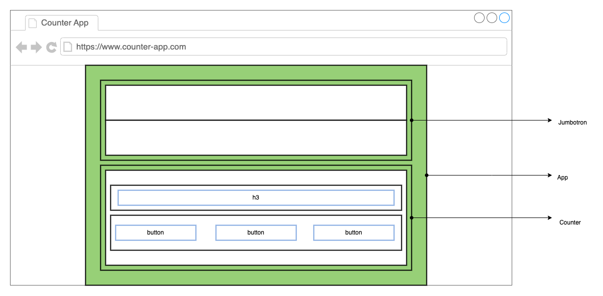
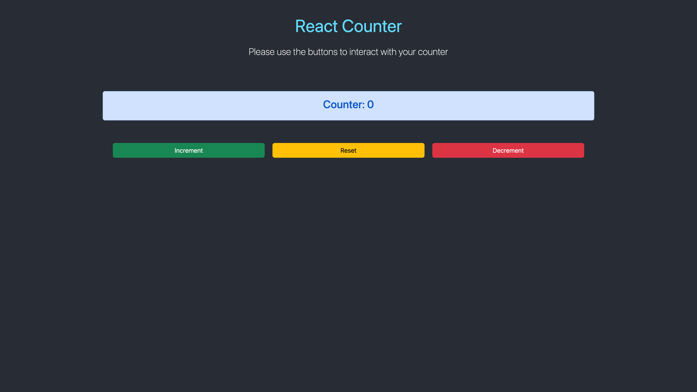

# Counter App - Class Based

## User Story

As a user I want to be increase a counter value, decrease a counter value up to 0, and reset a counter value to 0.

## Acceptance Criteria

- The app should be presented with a banner that contains a title of "React Counter" and a subtitle of "Please use the buttons to interact with your counter.".
- The counter value should be displayed as `Counter: 0` on initial load.
- The counter value should increase the current count value by 1 when the user clicks on the "Increment" button.
- The counter value should decrease the current count value by 1 when the user clicks on the "Decrement" button.
- The counter value should reset the current count value to 0 when the user clicks on the "Reset" button.
- The counter value should not decrement below `0` (no negative values for the counter).

## Technical Criteria

- Use class-based components
- Ensure that the code follows semantic HTML structure
- Ensure that the code is well structured in to re-useable components
- Ensure the codebase follows the React files and folder structure
- Deploy the react application using [GitHub pages](https://github.com/gitname/react-gh-pages)

## Additional Resources

- You can use [Bootstrap 5](https://getbootstrap.com/docs/5.3/getting-started/introduction/) as your CSS framework
- You can choose a colour palette from [coolors](https://coolors.co/)
- You can import [font-awesome icons](https://fontawesome.com/icons) using the [CDN](https://cdnjs.com/libraries/font-awesome)

## Wireframe Guide

Please use this high level wireframe as a guide for your portfolio and you are free to choose your own colours and/or layout if needed.

## Example Application

